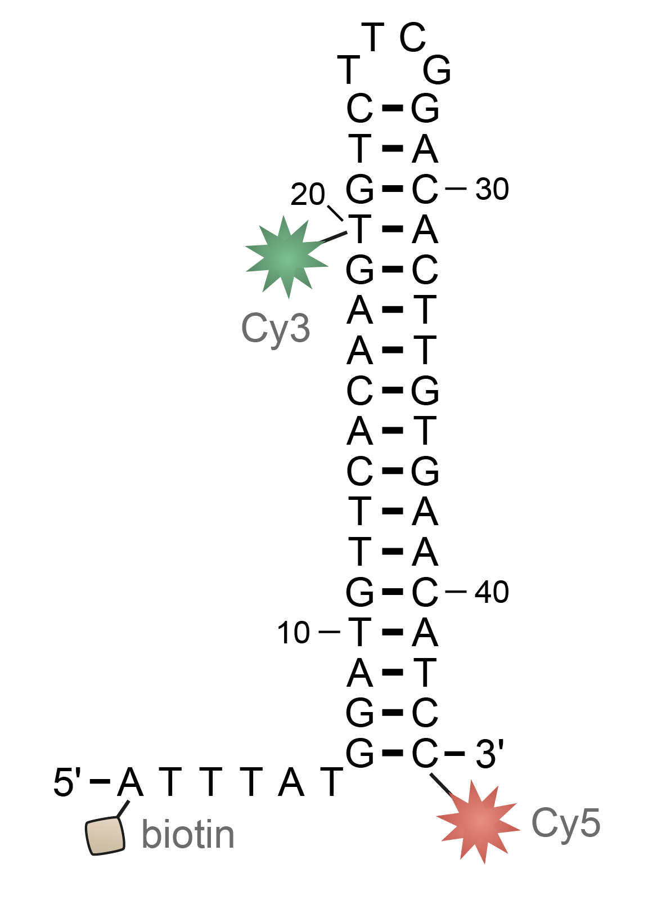

# Analysis of DNA hairpin dynamics with FRETraj

This repository demonstrates the use of *FRETraj* for high throughput accessible-contact volume calculation (multi-ACV) and subsequent FRET prediction. The workflow is outline in an interactive *Jupyter* notebook which can be run locally or directly on  without any installation.

> Note: Binder needs to build the image from the repository which can take a few seconds.

We have run an 1 &mu;s MD simulation of a DNA hairpin, computed multi-ACVs for Cy3 and Cy5 at residues T20 and C44 along th trajectory and predicted FRET efficiencies for every snapshot with a timestep of 100 ps. 

The repository contains the PBC-corrected MD trajectory (`data/DNA_hairpin.xtc`), the experimental burst size distribution (`data/burst_sizes.dat`), the computed and serialized FRET object (`data/FRET_DNA_hairpin.pkl`) as well as the ACV distances (*R*DAsub>, `data/R_kappa.dat`).
